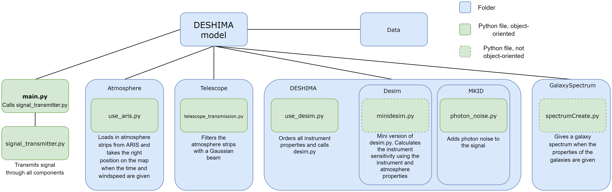
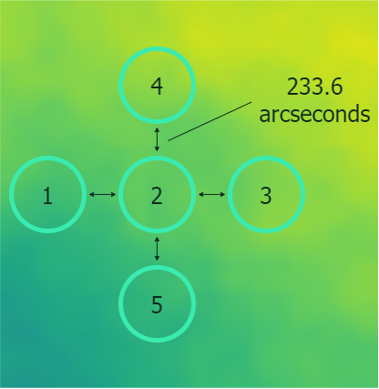

## Overview of the model 
The image below shows a schematic overview of how the model is built up. 

In order to run the model, create a directory ```output_ARIS``` in ```tiempo/Data``` with ARIS files.

## Output of the model 
The model outputs the following data: 
1. Vector of the time: all moments in time at which the signal is calculated in s.
2. Matrix of the power: matrix of all the power values of the signal in W. It has dimensions [5, #filters, #timesamples]. The first dimension equals 5, as 5 pwv values are taken in each timesample. 
3. Matrix of the sky temperature: matrix of the power converted to sky temperature (has the same dimensions as the matrix of the power) in K. 
4. Center frequencies of the filters: The center frequencies of the filters in the filterbank in the MKID chip in Hz. 

The pwv values are taken in the following order: 


## Using the model
The model is operated from *main.py*. In this file, there are different variables that can be set: 

### Atmosphere
**pwv_0** (*float*): The value of the precipitable water vapor that is added to the dpwv from ARIS in mm. 
**windspeed** (*float*): The windspeed of the atmosphere in m/s.
**prefix_atm_data** (*string*): The beginning of the name with which the atmosphere data is saved in *./Data/output_ARIS*. For example, if the files are called
*sample-00.dat-000*, *sample-00.dat-001* etc, then Prefix_atm_data must be 'sample-00.dat-'
**grid** (*float*): The width of a grid square in the atmosphere map in m
**max_num_strips** (*integer*): The number of atmosphere strips that is saved in *./Data/output_ARIS*
**x_length_strips** (*float*): The length of one atmosphere strip in the x direction. This is the number of gridpoints, *not* the distance in meters. Thus, this is an integer number, taken as a float to make sure calculations with this number result in a float. 

### Galaxy
**luminosity** (*float*): Luminosity of the galaxy, in Log(L_fir [L_sol])
**redshift** (*float*): The redshift of the galaxy
**linewidth** (*float*): The linewidth, in km/s

### Observation
**EL** (*float*): The elevation of the telescope, in degrees
**obs_time** (*float*): The observation time. This parameter has to be smaller than **max_obs_time**, which is calculated using the windspeed and the total length of the strips of atmosphere data, in s.
**draw_filters** (*list*): List of the filters that need to be plotted in the final plot (starts counting at 1, NOT 0). For example, if draw_filters = [1, 2], the first and the second filter are plotted, and if draw_filters = [1, 347], the first and the last filter are plotted. 
**save_name_plot** (*string*): The name with which the produced plot is saved. 
**save_name_data** (*string*): The name with which the produced data is saved to *.Data/output_DESHIMA_model/*. The center frequencies of the filters are saved as *save_name_data_F.npy* and the sky temperature matrix is saved as *save_name_data_T.npy*

### Important
1. All atmosphere strips must have the same length in the x direction and a length in the y direction of at least 30 gridpoints. ('length' means number of gridpoints, *not* distance in meters)
2. If **pwv_0** is changed, signal_transmitter.save_filtered_pwv_map() needs to run again to save the right pwv map (See section 'Changing the atmosphere data' to see how'). 

## Changing the atmosphere data
1. Save the new atmosphere data in *./Data/output_ARIS/*
2. Change **prefix_atm_data**, **grid**, **max_num_strips**  and **x_length_strips** in *main.py* and the **x_length_strips** property of *use_aris.py* to the right values. 
3. From *main.py* run signal_transmitter.save_filtered_pwv_map() with the signal_transmitter instance in *main.py*. This function loads in and filters the complete atmosphere map (consisting of all atmosphere strips). This will save computation time when simulations with a large observing time are done. 

Now *main.py* can be used like always again. 

## Changing the number of filters or the distribution of the center frequencies of the filters
For each filter, an interpolation between the power and the sky temperature is made. This means that these interpolations need to be made and saved again if the center frequencies of the filters are changed. This is done as follows: 

1. Go to *./DESHIMA/MKID/filterbank.py*
2. Change **num_filters** for a different number of filters, **F_min** for a different lowest center frequency or **R** for a different spectral resolution. For a different distribution of the center frequencies, edit *self.filters* in the init function of the filterbank class. 
3. Run *filterbank.py*

Now the new interpolation curves should be saved in *./Data/splines_Tb_sky*. Now make sure *self.filters* in *signal_transmitter.py* is the same vector as *self.filters* in *filterbank.py* and the model can be used again. 


 
